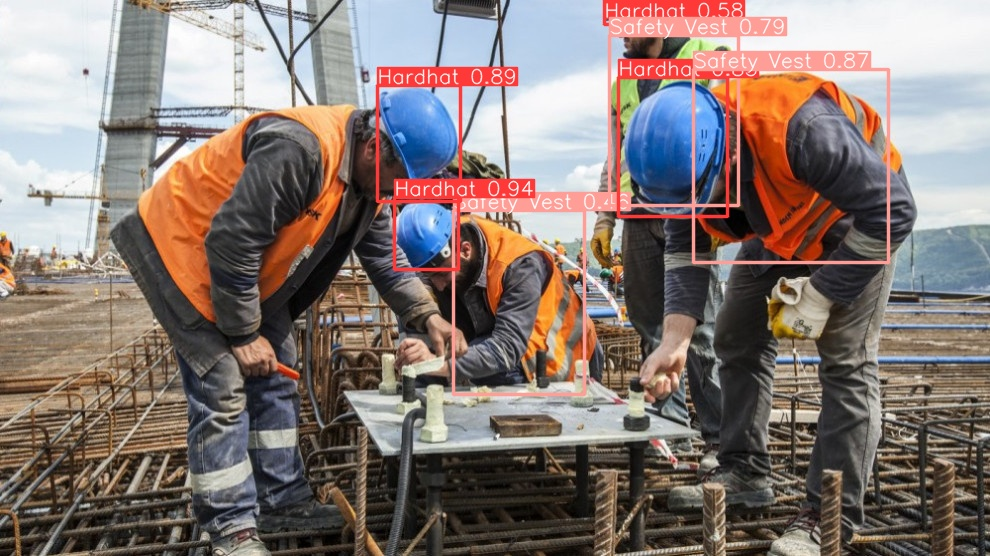
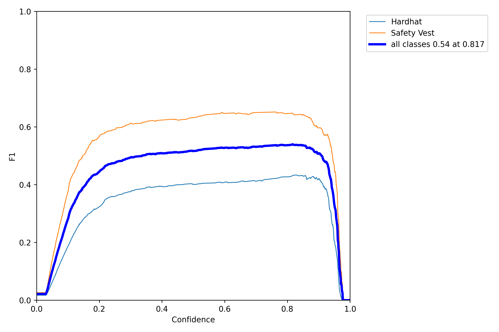
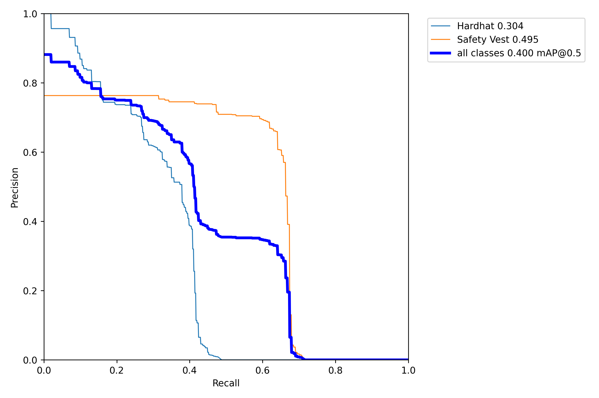

# Hardhat & Safety Vest Object Detector with YOLO v6

## Approach
This project was implemented following YOLOv6 official Github [Docs](https://github.com/meituan/YOLOv6/blob/main/docs/Train_custom_data.md).

The resulting model can be found under `assets` directory as well as the `YAML` file.

## Dataset
The model was trained on the Hardhat and Safety Vest dataset available on <a href='https://www.kaggle.com/datasets/johnsyin97/hardhat-and-safety-vest-image-for-object-detection'>Kaggle</a>

It contains two classes:
* Hardhat
* Safety Vest

Labels are in `txt` format which is the required format for YOLO

Results:

The model metrics were not that much as it needs to be trained for more time and the dataset needs to be larger.

**Best thing is to use this notebook on Google Colab or on a Linux machine to make the code automative as possible and avoid dependency issues.**
